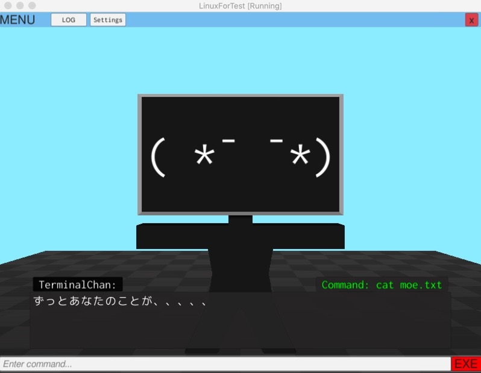
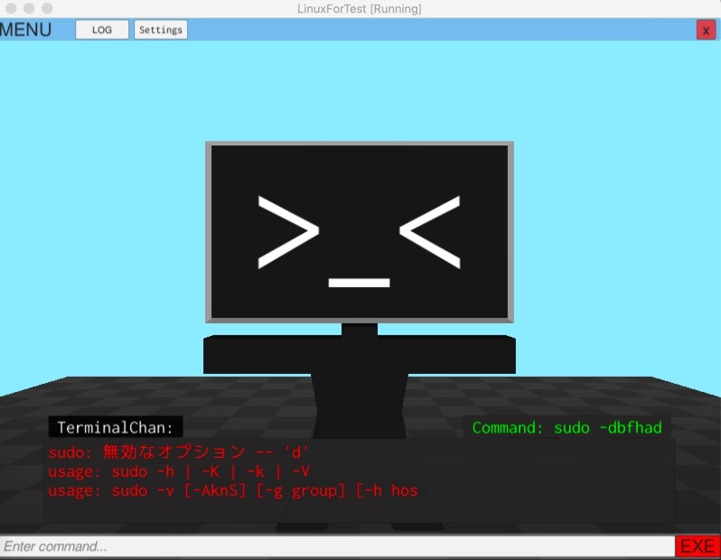
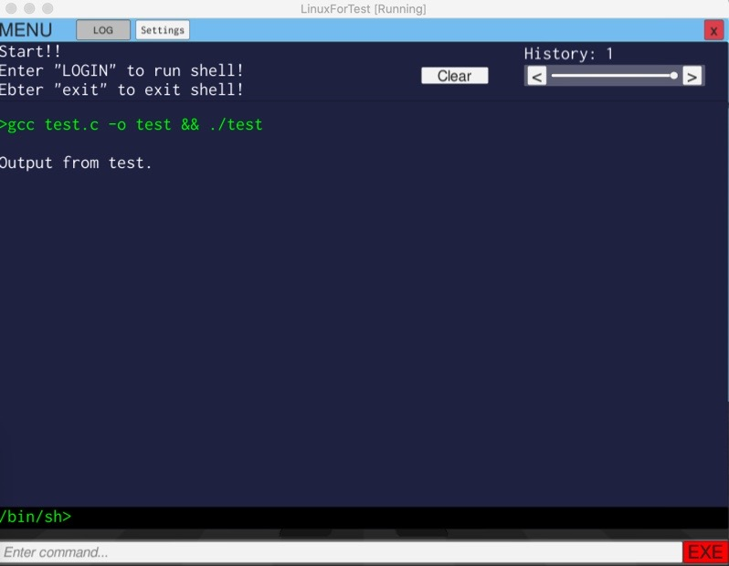
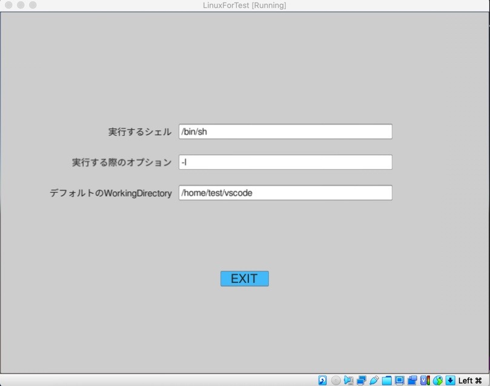

# TerminalChan

# What is this?
- Idea for Custom output of Shell Execution (like a terminal emulator) With "Unity"
    - Enjoyable chat with "TerminalChan"
    - Log
    - When focus inputField, original key event
        - Tab: Path suggestion
        - ArrowUp: previous input command

# images

# Download and Use (1): You can use Unity
- Git clone
- Open repository with Unity
- Build for your environment, linux, MacOS, etc...

# Download and Use (2): You uses linux.x86-64
- Download from relese 
- Unzip
- open application in TerminalEmulator(Linux.x86_64)/TerminalEmulatorForLinux.x86_64

# MyPresentation For "MISW WELCOME PRESENTATION 2021"
- [presentation is here](https://snakesneaks.github.io/TerminalEmulatorWithUnity/RevealPresentation/export/)

# Yet done or Help for or problems: 
- Heavy
- Now, just execute shell. TTY or PTY might be better. <= **Now, sudo command needs option "-S" to enter superuser password...**
- Text style like "30m", "0m"
- StandardOutput is received "Line by Line". So it can display "a\n" but can't display "a". This also matters when prompt password like "Password: ".
- If StandardOutput is too long, text is not displayed fully. This may cased from "Mesh vertices must be under 65,000". 
- hide input text for "password"
- like vim command, Is is unable to execute. Maybe because this is not "Terminal". 
- Signal like "Ctrl+c, Ctrl+d" is not sent to process. So you can't stop child process.
- Customization: "Use your image for TerminalChan", "Text show speed.", etc
- More friendly command assist may be great!
- More cuty "TerminalChan" responding to command or result might generate "MOE", japanese culture.
- Others
