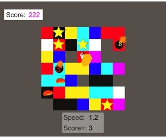
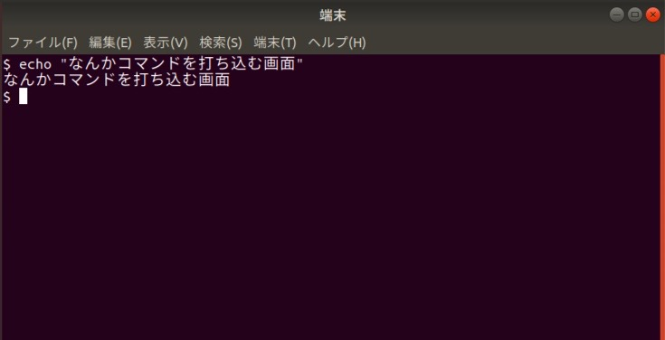
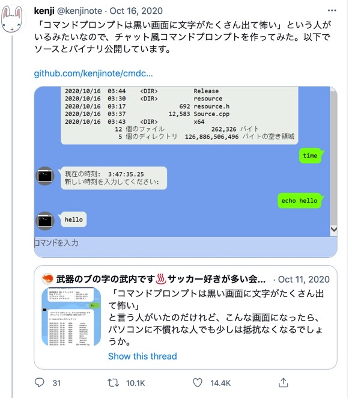

# ターミナルエミュレータっぽいもの作ってみた

---

## わたしは誰? (1)

* 55代　ヘビ 
* 早稲田　情報理工学科　2年
* UnityとかBlenderを細々やっている人（いや人じゃなくてヘビ）
* Macユーザー (Windowsは知らない子)

* 気軽に絡んでくれると嬉しい、、、

* [twitter: @snakesneaks](https://twitter.com/snakesneaks)

---

## わたしは誰? (2)

* [今年の新刊サイト](https://event.misw.jp/shinkan2021/)に簡単なゲーム、あります

* 地面に穴を開けて爆弾を落として生き延び続けるエンドレスのゲーム{.fragment .fade-down}
* ただの宣伝です、はい{.fragment .fade-down}

---

## 今回作ったもの

* Windowsユーザ的には「コマンドプロンプトっぽいもの」

* Macユーザのヘビ的には「ターミナルエミュレータっぽいもの（実際は違うかも）」

* 何も分からない人的には、「コマンドを打ち込む怖い画面」

LINUXのターミナル(端末)はこれ

---

## ところで
* Line風コマンドプロンプトをご存知ですか?

* https://twitter.com/kenjinote/status/1316816210621657088?s=20

---

## ターミナルの動作（ざっくり）

* シェルを実行
* 入力をシェルに渡す
* 出力をシェルから受け取る
* 画面に結果を表示

---

## 今回作ったもの
* シェルを実行
* 入力をシェルに渡す
* 出力をシェルから受け取る
* 画面に結果を表示

* 「ギャルゲーっぽく」できるんじゃないか？

* [github repository](https://github.com/SnakeSneakS/TerminalEmulatorWithUnity)

---

## 今回作ったもの(画面に見せる)
* "実行したいコマンド"
* pwd, 
* ls, 
* cd ./{PATH} <= [[TAB]]
* a <= あえてのエラ〜
* cat test.c
* gcc text.c && ./a.out
* code ./a.txt <=> "text"
* cat ./long.txt

---

## 終了
* ありがとうございました！！
